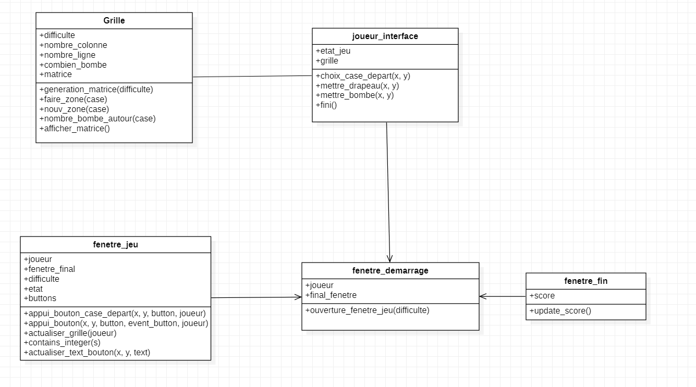

# POO_demineur
Cours PPMD POO 

### Structure

Le dossier UMLversion 1 contient les diagrammes UML des premiers cours lors de la phase d'analyse.

Le diagramme de classe final du code d'interface graphique se trouve à la racine du projet.

Le dossier programme_console_intermediaire est le programme qui se joue sur la console. C'est la version intermédiaire car pour l'interface graphique, le code a été amélioré et corrigé.

Le dossier programme_interface_FINAL contient le jeu démineur avec son interface graphique.

### Comment lancer le jeu ?

Pour le jeu sur la console, il faut lancer la classe Joueur.

Pour le programme sur interface graphique final, il faut lancer la classe fenetre_demarrage.
